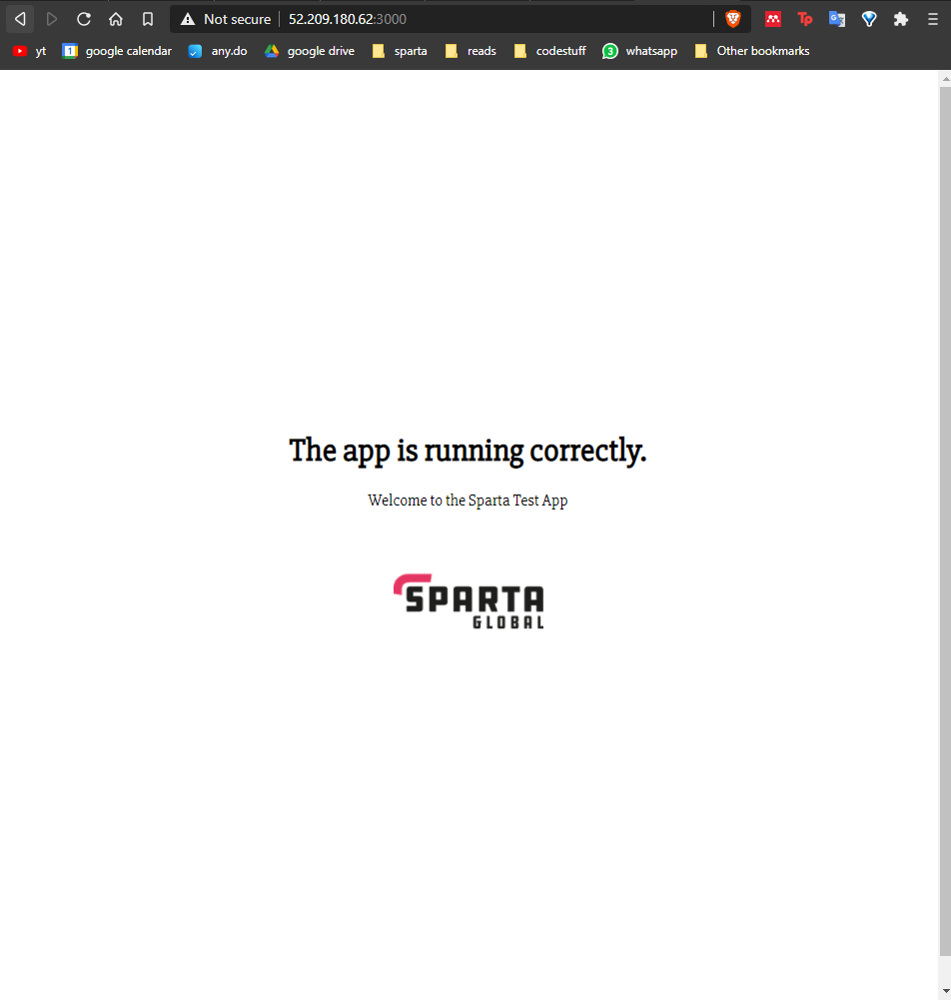
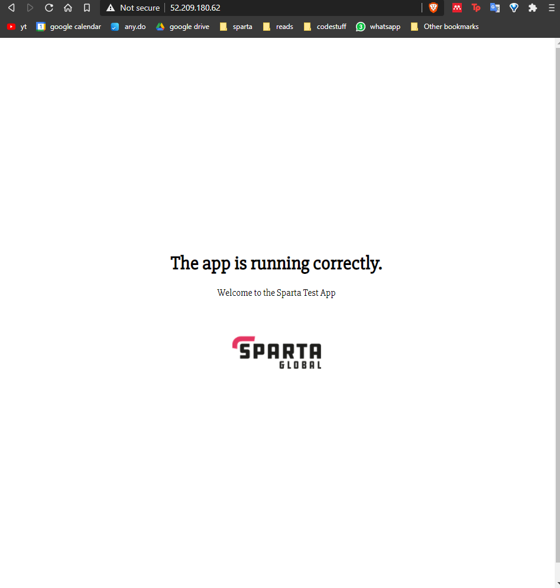

# AWS

## The Cloud

Cloud computing is the on-demand availability of computer system resources, especially data storage (cloud storage) and computing power, without direct active management by the user.

**DevOps and the Cloud**

- Will make sure we use cloud to our advantage
	- Can expand if it is successful
	- Reduce if we don't get traction needed
	- All without committing large quantities of cash, possibly endangering other sections of the business
	- Shared responsiblity model: 
		- Amazon responsible for security of the cloud (mostly physical)
		- User is responsible for security inside your cloud and how it interacts with the outside

**Capital Expenditure vs. Operational Expenditure**

## AWS

Amazon Web Servers is a public cloud provider, offering 175 fully featured services from data centers placed around the globe

AWS offer infrastructure technologies like compute, storage, and databases as well as emerging technologies, such as machine learning and artificial intelligence, data lakes and analytics, and Internet of Things.

## Setting Up an Instance on EC2

**Amazon Elastic Compute Cloud (EC2) provides scalable computing capacity in the AWS cloud**

- EC2 eliminates need to invest in hardware up front, so businesses can develop and deploy applications faster
- EC2 can launch any number of virtual servers as needed, as well as security, networking, and storage configuration
- EC2 enables businesses to scale up or down to handle changes in requirements or spikes in popularity, reducing the need to forecast traffic

### Security Groups

A security group acts as a virtual firewall for an EC2 instance to control inbound and outbound traffic
- Security groups act at the instance level, not subnet level, therefore each instance within a subnet can be assigned to a different set of security groups
- For each security group, add rules that control the inbound traffic to instances, and a separate set of rules that contorl the outbound traffic
	- Can specify allow rules, but not deny rules
	- Can specify separate rules for inbound and outbound traffic
	- SGs enable to filter traffic based on protocols and port numbers
	- By default, there are no inbound rules, i.e. no inbound traffic originating from another host to instance is allowed
	- By default, all outbound traffic is allowed

For this project, there are a few inbound rules that were to be configured when creating a new security group (involved in the set up of the instance):
| Type | Source | Port | Description |
| :--: | :----: | :--: | :---------: |
| SSH | My IP | 22 | Port 22 Home |
| TCP | My IP | 3000 | Port 3000 Home |
| HTTP | 0.0.0.0/0 | 80 | Port 80 for everyone |

The SSH inbound rule is crucial to just have the source as the instance creator's IP, as access to the instance is granted via SSHing in. The only inbound SSH traffic should be the instance creator.

### SSH Keys

At the final stage, the SSH key pair can be created/selected which consists of 
	- A public key that AWS stores
	- A private key file (``.pem`` extension) that should be stored in the ``~/.ssh`` directory (**THIS PRIVATE KEY IS ESSENTIAL TO CONNECTING WITH THE INSTANCE**)

**To SSH into the Remote Server**

Find the Public DNS for the instance via _Instances_-->_InstanceName_-->_Connect_-->_SSH Client_

and to SSH in use the command
```bash
ssh -i ~/.ssh/private_key_name.pem User@PublicDNS
```

### Copying files into Instance

Use Secure Copy, ``scp``, to copy files into the remote instance with the following structure

```bash
scp -i ~/.ssh/private_key_name path/to/file user@PublicIP:/path/to/new/file

scp -i ~/.ssh/private_key_name -r path/to/directory user@PublicIP:/path/to/new/directory
```

### Running the App in the Instance

After copying all the necessary code into JS run the ``environment/app/provision.sh`` (with the command ``sh``)file to make all essential installations and start the app

The ``proxy_config.conf`` file must be edited to have the public ip address of the instance.

**APP RUNNING ON PORT 3000**


**APP RUNNING ON PORT 80**



Can also check if the app is running on port 3000 on the instance private ip with ``curl``

```bash
$ curl <private IP>:3000

<!DOCTYPE html>
<html>
<head>
  <title>Provisioning Test Page</title>
  <link href="https://fonts.googleapis.com/css?family=Slabo+27px" rel="stylesheet">
  <style type="text/css">
    body {
      text-align:center;
      font-family: 'Slabo 27px', serif;
      height:100vh;
    }

    .vertical-center {

      position:relative;
      top:50%;
      transform: translateY(-50%);

    }

    img {
      width:150px;
    }
  </style>
</head>
<body>
  <div class="vertical-center">
    <h1>The app is running correctly.</h1>


    <p>Welcome to the Sparta Test App</p>
    
  </div>
</body>
</html>
```